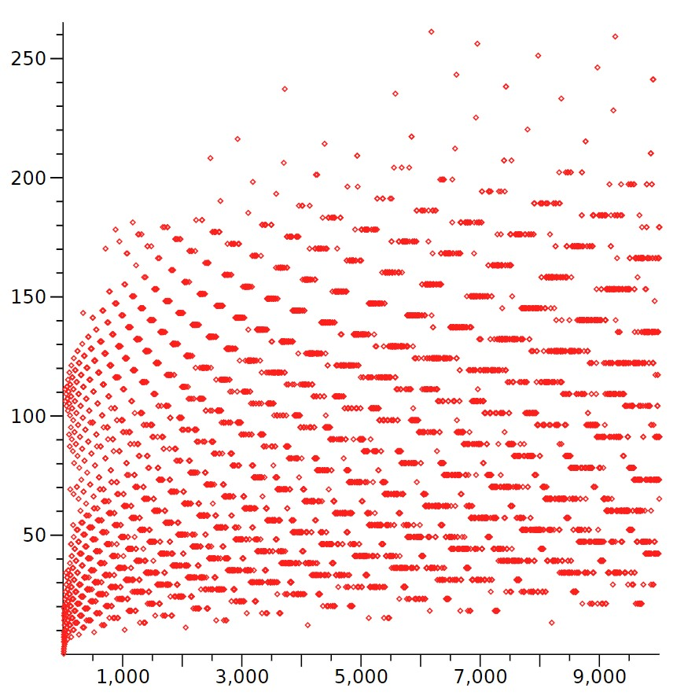

This program uses [Collatz sequences](https://en.wikipedia.org/wiki/Collatz_conjecture) to demonstrate the 
parallel calculation of tasks in Rust. We use the crossbeam library
for the parallelization.

[Open and run project for free in gipod.io](https://gitpod.io/#https://github.com/literadix/collatz)

There

    cargo build --release
    ./target/release/collatz 100 
    time ./target/release/collatz 1000000 > /dev/null
